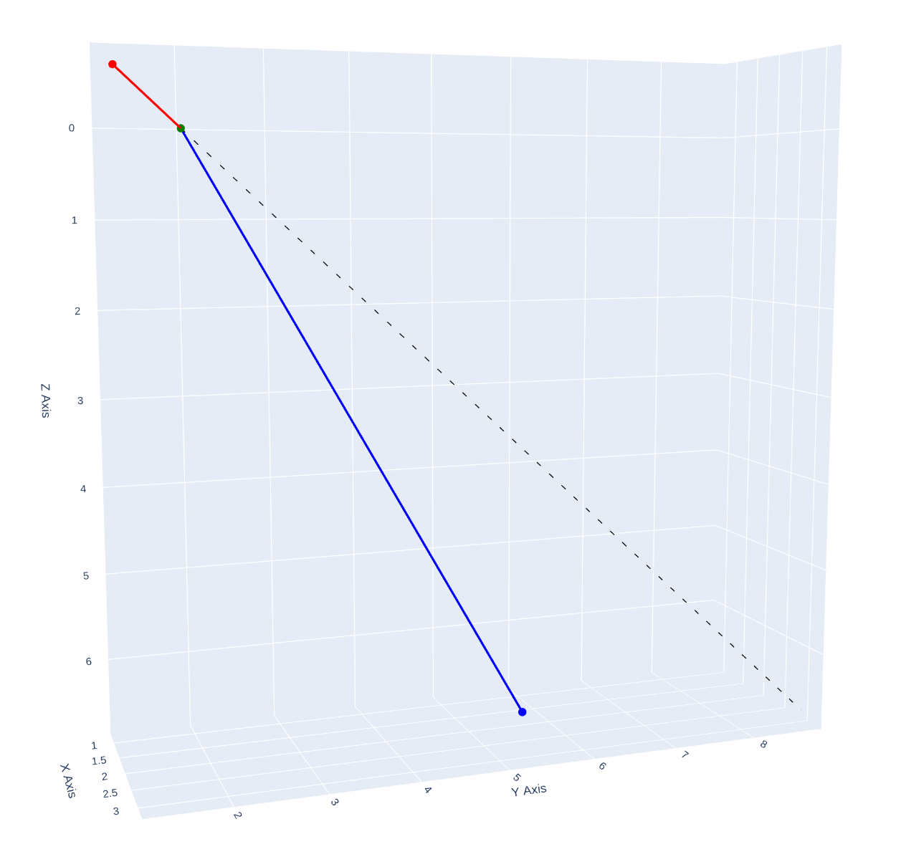

## Simulation
The following is one of the runs using snell law, where we have the following set up \n   
entry_point = (1, 2, 0)  # Example entry point on the top surface     \n 
incident_vector = (1, 3, 3)  # Incident light vector     \n 
thickness = 6.66  # Thickness of the glass in mm    \n 
refractive_index = 1.47  # Refractive index of the glass \n 
\n

    

## Mathmatical Concept
citation: Thanks to a StackExchange Post that shows the induction of Shell's Law in Vector Form.

Components with respect to **n**

```math
\mathbf{r} = \mathbf{r}_{\parallel} + \mathbf{r}_{\perp}
```

One parallel and the other normal to axis **n** respectively:

```math
\mathbf{r}_{\parallel} = (\mathbf{n} \cdot \mathbf{r}) \mathbf{n}
```

```math
\mathbf{r}_{\perp} = (\mathbf{n} \times \mathbf{r}) \times \mathbf{n} = \mathbf{r} - (\mathbf{n} \cdot \mathbf{r}) \mathbf{n}
```

That is:

```math
\mathbf{r} = (\mathbf{n} \cdot \mathbf{r}) \mathbf{n} + (\mathbf{n} \times \mathbf{r}) \times \mathbf{n}
```

The vectors **t**, **i** are decomposed as follows:

```math
\mathbf{t} = (\mathbf{n} \cdot \mathbf{t}) \mathbf{n} + (\mathbf{n} \times \mathbf{t}) \times \mathbf{n}  \tag{1}
```

```math
\mathbf{i} = (\mathbf{n} \cdot \mathbf{i}) \mathbf{n} + (\mathbf{n} \times \mathbf{i}) \times \mathbf{n}  \tag{2}
```

Now, Snell's Law is expressed as:

```math
(\mathbf{n} \times \mathbf{t}) = \mu (\mathbf{n} \times \mathbf{i}) \tag{3}
```


Equation (1) combined with (2) and (3) yields:

```math
\mathbf{t} = (\mathbf{n} \cdot \mathbf{t}) \mathbf{n} + \mu [\mathbf{i} - (\mathbf{n} \cdot \mathbf{i}) \mathbf{n}] \tag{4}
```

Taking norms in (4), and since the vector $` (\mathbf{n} \cdot \mathbf{t}) \mathbf{n} `$ is normal to the vector $` [\mathbf{i} - (\mathbf{n} \cdot \mathbf{i}) \mathbf{n}] `$:

```math
\|\mathbf{t}\|^2 = (\mathbf{n} \cdot \mathbf{t})^2 + \mu^2 \|\mathbf{i} - (\mathbf{n} \cdot \mathbf{i}) \mathbf{n}\|^2
```

or:

```math
1 = (\mathbf{n} \cdot \mathbf{t})^2 + \mu^2 \left[ 1 - (\mathbf{n} \cdot \mathbf{i})^2 \right]
```

So:

```math
(\mathbf{n} \cdot \mathbf{t}) = \pm \sqrt{1 - \mu^2 \left[ 1 - (\mathbf{n} \cdot \mathbf{i})^2 \right]} \tag{5}
```

Since the angle between **n**, **t** is less than $`\pi/2`$, we keep the plus sign in (5), and (4) yields finally:

```math
\mathbf{t} = \sqrt{1 - \mu^2 \left[ 1 - (\mathbf{n} \cdot \mathbf{i})^2 \right]} \mathbf{n} + \mu \left[ \mathbf{i} - (\mathbf{n} \cdot \mathbf{i}) \mathbf{n} \right]
\]
